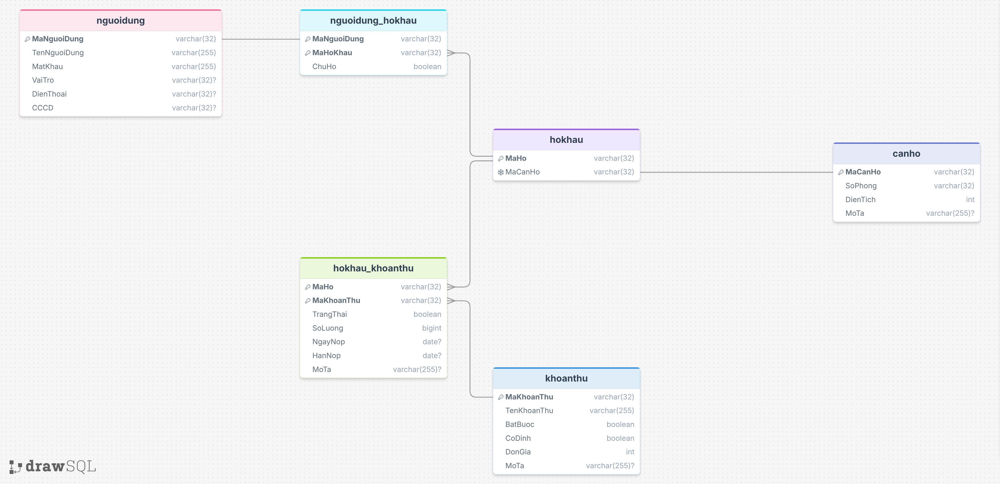

<<<<<<< HEAD
# CNPM_project
Link tài liệu : [tại đây](https://drive.google.com/drive/folders/1k0PA6YF26ZEIcBk8OdzGHb8hhUWfktM4?usp=sharing)  
**GIỚI THIỆU BÀI TOÁN**    
Chung cư BlueMoon tọa lạc ngay ngã tư Văn Phú được khởi công xây dựng năm 2021
và hoàn thành vào 2023. Chung cư được xây dựng trên diện tích 450m2, gồm 30 tầng,
tầng 1 làm kiot, 4 tầng đế, 24 tầng nhà ở và 1 tầng penhouse. Khi sở hữu nhà chung cư,
hộ gia đình hoặc chủ sở hữu sẽ phải bỏ ra một khoản kinh phí đóng định kỳ để thực
hiện vận hành và bảo dưỡng thường xuyên về cơ sở vật chất. Các hoạt động quản lý và
thu phí ở chung cư BlueMoon được thực hiện bởi Ban quản trị chung cư do nhân dân
sinh sống ở đây bầu ra.
Hàng tháng Ban quản trị chung cư lập danh sách các khoản phí cần đóng với
mỗi hộ gia đình và gửi thông báo thu tiền. Các khoản phí chung cư gồm nhiều loại:
+ Phí dịch vụ chung cư, đây là loại phí bắt buộc nộp theo tháng, ban quản lý
chung cư để chi trả vào các việc như: Lau dọn vệ sinh và bảo dưỡng các khu vực chung,
làm đẹp cảnh quan của các khu vực chung; thu gom rác thải, bảo dưỡng sân vườn; đảm
bảo an ninh... Phí dịch vụ chung cư được tính theo diện tích căn hộ sở hữu, hiện nay
dao động từ 2.500 đồng tới 16.500 đồng/m2/tháng.
+ Phí quản lý chung cư, đây cũng là chi phí bắt buộc nộp theo tháng, dùng cho
tất cả các hoạt động quản lý cũng như vận hành nhà chung cư. Chi phí này phụ thuộc
vào tiêu chuẩn, chất lượng của dự án chung cư đó ví dụ như chung cư cao cấp, chung
cư thường hay nhà chung cư giá rẻ. Với chung cư BlueMoon phí quản lý ở mức từ
7.000 đồng/m2.
+ Các khoản đóng góp mà ban quản trị phối hợp với chính quyền địa phương, tổ
dân phố để thực hiện thu (ví dụ quỹ vì người nghèo, quỹ biển đảo, quỹ từ thiện,...). Các
khoản đóng góp này thu theo từng đợt, không bắt buộc và thu theo tinh thần tự nguyện.
Ban quản trị hiện đang quản lý việc thu phí theo phương thức thủ công, có sử
dụng một số công cụ hỗ trợ như Excel nhưng hiệu quả quản lý chưa cao. Hiện tại Ban
quản trị có nhu cầu xây dựng một phần mềm quản lý thu các loại phí tại chung cư
BlueMoon.
Ví dụ một mẫu sổ quản lý thu các khoản đóng góp:  
  
Hình 1-1: Ví dụ về mẫu giấy tờ thu chi đang thực hiện thủ công  
Trong phiên bản v1.0 của phần mềm, các chức năng cơ bản cần xây dựng cho Ban
quản trị bao gồm: quản lý thông tin các khoản thu phí đóng góp, quản lý thu phí của
các hộ gia đình. Ngoài ra phần mềm cũng cần cung cấp chức năng tra cứu, tìm kiếm
và một số thông tin thống kê cơ bản giúp Ban quản trị nắm được hiện trạng các khoản
thu. Nhằm giúp cho các hoạt động quản lý khác ở chung cư được thuận tiện và thông
suốt, Ban quản trị muốn xây dựng thêm các chức năng quản lý thông tin cơ bản về các
hộ gia đình (hộ khẩu) và nhân dân (nhân khẩu) đang sinh sống tại BlueMoon. Các chức
năng này giúp Ban quản trị có thể cung cấp thông tin (chi tiết về hộ gia đình, nhân khẩu
trong hộ, các hoạt động biến đổi nhân khẩu, tạm vắng, tạm trú,...) cho cơ quan chức
năng khi được yêu cầu. Các chức năng này chỉ truy cập được sau khi Ban quản trị đăng
nhập thành công với tài khoản đã cung cấp. Ban quản trị cũng có thể quản lý các thông
tin cá nhân và thay đổi mật khẩu đăng nhập.
Trong phiên bản v2.0 phát triển tiếp theo của phần mềm, Ban quản trị muốn xây
dựng thêm chức năng quản lý các khoản thu: Phí gửi xe ở chung cư: thu từng tháng 
theo thông tin phương tiện đăng ký của hộ gia đình, trong đó phí gửi xe máy hàng tháng
là 70.000/xe/một tháng và phí gửi ô tô là 1.200.000 nghìn đồng/xe/một tháng. Chi phí
điện, nước, internet, đây là các khoản phí mà Ban quản trị thu hộ từng tháng theo thông
báo từ các công ty cung cấp dịch vụ tương ứng.
Phần mềm dự kiến được phát triển dưới dạng một ứng dụng desktop với công nghệ
Java, dữ liệu của phần mềm được lưu trữ tập trung trên MySQL server.
Luồng nghiệp vụ cần xử lý:
1. Đăng kí tài khoản
2. Tạo khoản thu
3. Thu phí
4. Thống kê các khoản đóng góp
=======

# *Thành phần Moduls*
1. Chức năng chính
    > Cung cấp khung dữ liệu cơ bản để tạo các đối tượng nhằm quản lý một cách thuận tiện và bảo mật.
2. Các thành phần trong modul.
    - CanHo
        - maCanHo: String
        - soPhong: String
        - dienTich: int
        - moTa: String
        - Các phương thức get lấy thuộc tính của đối tượng
        - Phương thức khởi tạo đối tượng không tham số và đầy đủ các tham số  
        *Ví dụ: new CanHo("123", "123", 32, "Phòng sạch sẽ") -> tạo đối tượng Căn Hộ mã 123, số phòng là 123, diện tích là 32 m², với mô tả là "Phòng sạch sẽ"*
    - HoKhau
        - maHo: String
        - maCanHo: String (mã căn hộ mà hộ khẩu này đang sử dụng)
        - Các phương thức get lấy thuộc tính của đối tượng
        - Phương thức khởi tạo đối tượng không tham số và đầy đủ các tham số  
        *Ví dụ: new HoKhau("101B", "101") -> tạo đối tượng Hộ Khẩu mã 101B, tại phòng số 101*
    - KhoanThu
        - maKhoanThu: String
        - tenKhoanThu: String
        - batBuoc: boolean (tức là kiểm tra khoản thu này là phải nộp hộ khẩu nào có khoản thu này?)
        - coDinh: boolean (tức là kiểm tra khoản thu này là hộ khẩu nào cũng có khoản thu này?)
        - donGia: int
        - moTa: String
        - Các phương thức get lấy thuộc tính của đối tượng
        - Phương thức khởi tạo đối tượng không tham số và đầy đủ các tham số  
        *Ví dụ: new KhoanThu("A01", "Dịch vụ chung", true, true, 5000, "Dịch vụ hàng tháng thu theo m²") -> tạo đối tượng Khoản Thu với mã khoản thu là A01, tên là Dịch vụ chung, mọi nhà đều có và bắt buộc phải nộp, đơn giá 5000 đồng với mô tả "Dịch vụ hàng tháng thu theo m²"*
    - NguoiDung
        - maNguoiDung: String
        - tenNguoiDung: String
        - matKhau: String
        - vaiTro: String
        - dienThoai: String
        - CCCD: String
        - Các phương thức get lấy thuộc tính của đối tượng
        - Phương thức khởi tạo đối tượng không tham số và đầy đủ các tham số  
        *Ví dụ: new NguoiDung("Admin01", "Trần Tuấn Nam", "12345678", "Admin", "0912345678", 036212345678") -> tạo đối tượng Người Dùng với mã là Admin01, tên là Trần Tuấn Nam, mật khẩu là 12345678, vai trò là Admin, điện thoaị 0912345678, số CCCD là 036212345678*
    - HoKhau_KhoanThu (thể hiện quan hệ 1-1 giữa 1 hộ khẩu và 1 khoản thu)
        - maHo: String
        - maKhoanThu: String
        - trangThai: boolean (true -> đã nộp, false -> chưa nộp)
        - soLuong: int
        - ngayNop: String
        - hanNop: String
        - moTa: String
        - Các phương thức get lấy thuộc tính của đối tượng
        - Phương thức khởi tạo đối tượng không tham số và đầy đủ các tham số  
        *Ví dụ: new HoKhau_KhoanThu("101B1", "A01", false, 32, null, null, null) -> tạo đối tượng thể hiện mã hộ 101B1 có khoản thu A01 chưa nộp, với số lượng là 32, ngày nộp, hạn nộp, mô tả đang để trống*
    - NguoiDung_HoKhau (thể hiện quan hệ 1-1 giữa 1 nhân khẩu và 1 hộ khẩu)
        - maNguoiDung: String
        - maHo: String
        - chuHo: boolean (true -> là chủ hộ, false -> không là chủ hộ)
        - Các phương thức get lấy thuộc tính của đối tượng
        - Phương thức khởi tạo đối tượng không tham số và đầy đủ các tham số  
        *Ví dụ: new NguoiDung_HoKhau("101B1", "101B", true) -> tạo đối tượng thể hiện nhân khẩu mà 101B1 thuộc hộ 101B và là chủ hộ*
    - PhienNguoiDung (nhằm lưu trữ thông tin người dùng đang đăng nhập hiện tại thông qua lớp bằng thuộc tính static)
        - nguoiDung: <u>NguoiDung</u>

# *Thành phần Service*
1. Chức năng chính
    > Cung cấp các thao tác với dữ liệu trong database và kiểm tra an toàn khi thao tác với dữ liệu (Tìm, Thêm, Xóa, Sửa)
2. Các thành phần trong Service
    - MySQL (Cung cấp kết nối với database)
        - <u>connect</u>(): Connection 
        Thiết lập các thông tin database mặc định trên máy bao gồm:
            - type: String (tên hệ quản trị database, ví dụ mysql)
            - host: String (địa chỉ kết nối, ví dụ mặc định mysql trên máy là localhost)
            - port: String (cổng kết nối, ví dụ mặc định mysql trên máy là 3306)
            - name: String (tên database, mỗi người có thể thiết lập khác nhau)
            - user: tên kho connection chứa database (mặc định trên máy là root)
            - password: mật khẩu đăng nhập vào connection chưa database (mặc định là null, mỗi người sẽ có thiết lập khác nhau)
        - <u>connect</u>(String url, String user, String password): Connection  
          (Lớp này không cần dùng trong quá trình thao tác dũ liệu chính)
    - CanHoService
        - <u>timCanHo</u>(String ma_so): List<CanHo> (trả về các đối tượng có mã Căn Hộ hoặc số Phòng trùng với đầu vào)
        - <u>themCanHo</u>(CanHo canHo): void (thêm căn hộ vào database với mã, số phòng và diện tích hợp lệ)
        - <u>xoaCanHo</u>(String ma_so): void (xóa căn hộ với mã Căn hộ hoặc số Phòng trùng với đầu vào)
        - <u>suaCanHo</u>(CanHo canHo): void (sửa thông tin căn hộ cũ với mã Căn hộ, số Phòng trùng với canHo đầu vào và thỏa mãn các ràng buộc khác)
    - HoKhauService
        - <u>timHoKhau</u>(String maHo): List<HoKhau> (trả về các đối tượng có mã Hộ Khẩu trùng với đầu vào)
        - <u>themHoKhau</u>(HoKhau hoKhau): void (thêm hộ khẩu vào database với mã Hộ Khẩu và mã Căn Hộ hợp lệ)
        - <u>xoaHoKhau</u>(String maHo): void (xóa hộ khẩu với mã Hộ Khẩu trùng với đầu vào)
        - <u>suaHoKhau</u>(HoKhau hoKhau): void (sửa thông tin hộ khẩu cũ với mã Hộ Khẩu trùng với canHo đầu vào và thỏa mãn các ràng buộc khác)
    - KhoanThuService
        - <u>timKhoanThu</u>(String ma_ten): List<KhoanThu> (trả về các đối tượng có mã Khoản Thu hoặc tên Khoản Thu trùng với đầu vào)
        - <u>themKhoanThu</u>(KhoanThu khoanThu): void (thêm khoản thu vào database với mã, tên và đơn giá hợp lệ)
        - <u>xoaKhoanThu</u>(String ma_ten): void (xóa căn hộ với mã Khoản Thu trùng với đầu vào)
        - <u>suaKhoanThu</u>(KhoanThu khoanThu): void (sửa thông tin căn hộ cũ với mã Khoản Thu với khoanThu đầu vào và thỏa mãn các ràng buộc khác)
    - NguoiDungService
        - <u>timNguoiDung</u>(String ma_ten_cccd): List<NguoiDung> (trả về các đối tượng có mã, tên, cccd trùng với đầu vào)
        - <u>themNguoiDung</u>(NguoiDung nguoiDung): void (thêm căn hộ vào database với mã, tên, cccd và mật khẩu hợp lệ)
        - <u>xoaNguoiDung</u>(String maNguoiDung): void (xóa căn hộ với mã Người Dùng trùng với đầu vào)
        - <u>suaNguoiDung</u>(NguoiDung nguoiDung): void (sửa thông tin căn hộ cũ với mã Người Dùng trùng với canHo đầu vào và thỏa mãn các ràng buộc khác)
    - NguoiDung_HoKhauService
        - <u>timHoKhau</u>(String maNguoiDung): NguoiDung_HoKhau (trả về hộ khẩu của mã người dùng trùng với đầu vào)
        - <u>timNguoiDung</u>(String maHo): List<NguoiDung_HoKhau> (trả vể các người dùng của mã hộ khẩu trùng với đầu vào)
        - <u>themNguoiDung_HoKhau</u>(NguoiDung_HoKhau nguoiDungHoKhau): void (thêm quan hệ 1-1 người dùng - hộ khẩu thu hợp lệ)
        - <u>xoaNguoiDung_HoKhau</u>(String maNguoiDung, String maHo): void (xóa quan hệ người dùng - hộ khẩu với mã người dùng và hộ khẩu trùng với đầu vào)
        - <u>suaNguoiDung_HoKhau</u>(HNguoiDung_HoKhau nguoiDungHoKhau): void (sửa thông tin quan hệ người dùng - hộ khẩu với mã người dùng và mã hộ khẩu trùng với nguoiDungHoKhau đầu vào và thỏa mãn các ràng buộc khác)
    - HoKhau_KhoanThuService
       - <u>timKhoanThu</u>(String maHo): List<HoKhau_KhoanThu> (trả về các khoản thu của mã hộ khẩu trùng với đầu vào)
       - <u>timHoKhau</u>(String maKhoanThu): List<HoKhau_KhoanThu> (trả vể các hộ khẩu của mã khoản thu trùng với đầu vào)
       - <u>themHoKhau_KhoanThu</u>(HoKhau_KhoanThu hoKhauKhoanThu): void (thêm quan hệ 1-1 hộ khẩu - khoản thu hợp lệ)
       - <u>xoaHoKhau_KhoanThu</u>(String maHo, String maKhoanThu): void (xóa quan hệ hộ khẩu - khoản thu với mã hộ khẩu và khoản thu trùng với đầu vào)
       - <u>suaHoKhau_KhoanThu</u>(HoKhau_KhoanThu hoKhauKhoanThu): void (sửa thông tin quan hệ hộ khẩu - khoản thu với mã hộ khẩu và mã khoản thu trùng vơi hoKhauKhoanThu đầu vào và thỏa mãn các ràng buộc khác)

<!--
Superscript:
¹ ² ³ ⁴ ⁵ ⁶ ⁷ ⁸ ⁹ ⁰

Subscript:
₀ ₁ ₂ ₃ ₄ ₅ ₆ ₇ ₈ ₉
-->
>>>>>>> origin/Nam1
